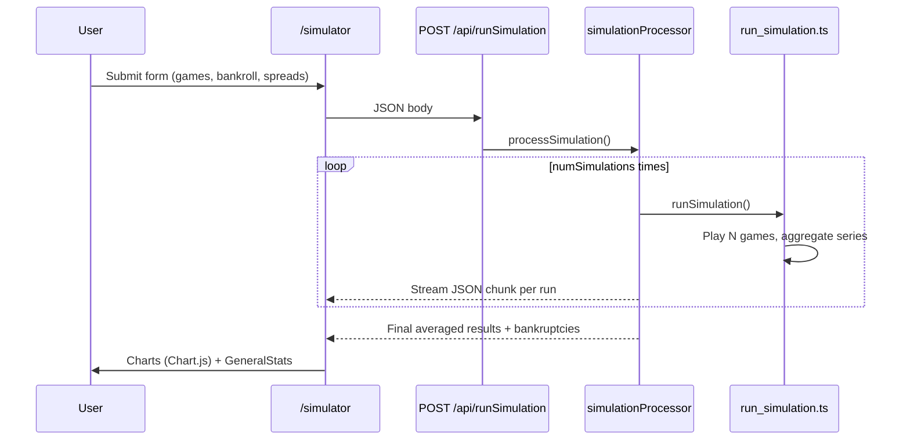

# Architecture — Blackjack-Sim

## Repository layout

```
Blackjack-Sim/
├── blackjack-sim/          # Production app (Next.js 14 App Router)
│   ├── src/
│   │   ├── app/            # Pages + API routes
│   │   ├── components/     # UI + game classes (Deck, Card, BlackjackGame)
│   │   ├── run_simulation.ts   # Monte Carlo loop
│   │   └── strategies.ts       # Basic strategy tables
│   └── public/
├── blackjack-sim-python/   # Legacy Streamlit prototype (reference only)
├── docs/                   # Deep documentation
├── scripts/                # Verification & automation
└── AGENTS.md, COMPLETION.md, TASKS.md, ROADMAP.md
```

---

## Request flow (web app)



---

## Simulation engine

### Game loop (`run_simulation.ts`)

For each of `numGames`:

1. **Reshuffle** when deck drops below a random 20–40% penetration threshold (TypeScript) or fixed 15 cards (Python legacy).
2. **Bet sizing** from Hi-Lo true count (running count ÷ decks remaining) via user-defined spread (`BettingValues`) or built-in defaults.
3. **Bankruptcy guard** — stop if `bankroll < betAmount`.
4. **Play hand** via `BlackjackGame.startGame()`.
5. **P&L** — blackjack pays 3:2; wins/losses update bankroll and time series arrays.

Monte Carlo: `numSimulations` independent runs; server averages each time-series index across runs.

### Blackjack rules (implemented)

| Rule | Implementation |
|------|----------------|
| Basic strategy | `strategies.ts` hard/soft/pair tables |
| Hi-Lo count | `BlackjackGame.updateRunningCount` |
| Dealer S17 | Hits soft 17 in `dealerTurn()` |
| Split pairs | `splitHand()` — partial (no re-split, no ace rules) |
| 3:2 blackjack | `betAmount * 1.5` in P&L |
| Multi-deck shoe | `Deck(numDecks)` constructor param |

### Not implemented (but mentioned in UI rules)

- Double down
- Insurance
- Dealer peek for blackjack
- Surrender (correctly documented as N/A)

See [`KNOWN-ISSUES.md`](KNOWN-ISSUES.md).

---

## Frontend

| Route | Purpose |
|-------|---------|
| `/` | Landing + link to simulator |
| `/simulator` | Form → fetch → results dashboard |
| `/api/runSimulation` | POST — runs simulation, streams JSON |
| `/api/refreshCache` | GET — clears S3 cache (requires AWS creds) |

**UI stack:** Chakra UI, Tailwind, Chart.js / react-chartjs-2, Framer Motion (cards).

**Charts:** cumulative profit, running count distribution, bet frequency, bankroll over time, net profit per bet amount, etc.

---

## Caching (optional, currently disabled)

`fileCacheManager.ts` targets S3 bucket `blackjack-sim-cache`. Cache read/write in `runSimulation/route.ts` is **commented out**. When enabled:

- Key: `numGames-initialBankroll-numSimulations-{spread values}` (missing `numberOfDecks` — bug)
- Multipart upload for large payloads via `multipartUpload.ts`

---

## Python prototype

`blackjack-sim-python/` mirrors core logic for Streamlit charts. Divergences:

- Fixed 15-card reshuffle vs random penetration in TS
- No custom betting spread UI
- Includes confidence interval / required games helpers in `utils.py`

Treat as **reference**, not source of truth for production.

---

## Deployment

- **Vercel** (`vercel.json`, Analytics + Speed Insights)
- Env vars for S3 (optional): `AWS_ACCESS_KEY_ID`, `AWS_SECRET_ACCESS_KEY`, `AWS_REGION`

---

## Agent platform integration

On this server, the repo is linked at:

```
/srv/projects/blackjack-sim/repo → /srv/Blackjack-Sim
```

Use `agent-loop blackjack-sim` for unattended sessions. Stop phrase: **`BLACKJACK COMPLETE — stopping.`**
